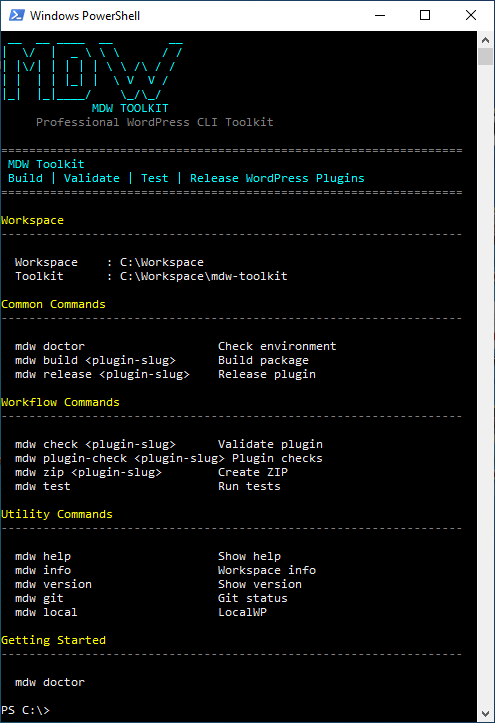
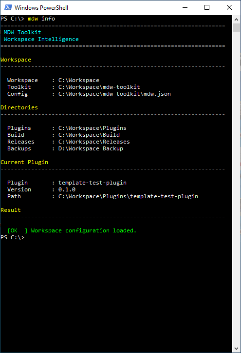
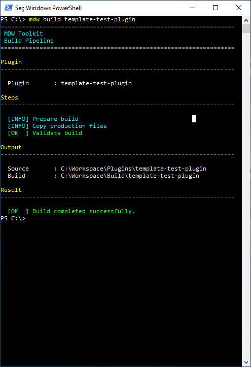
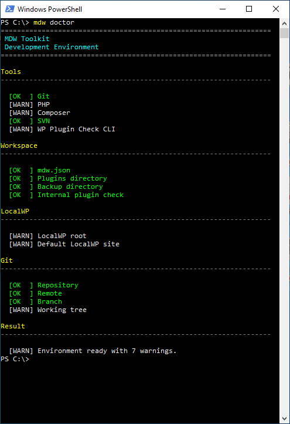
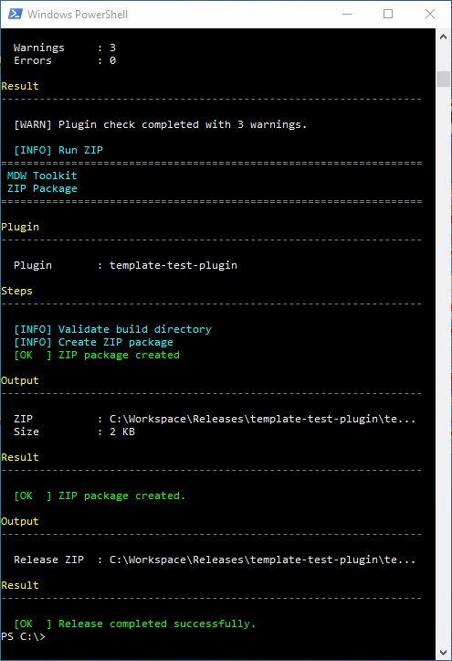
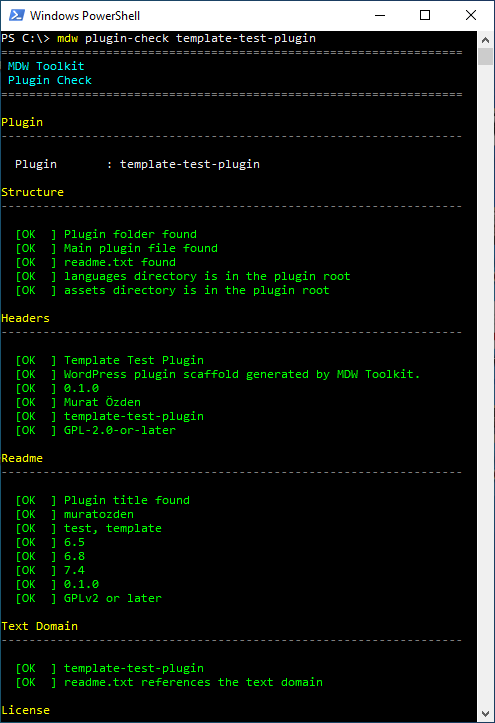
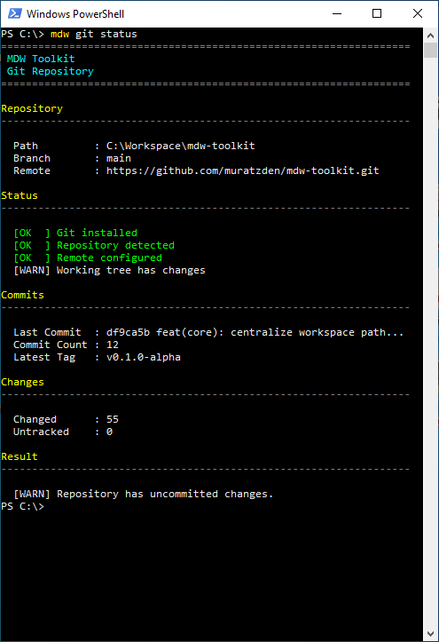

# MDW Toolkit

> Professional WordPress CLI Toolkit for building, validating, testing and releasing WordPress plugins.

<p align="center">


</p>

---

MDW Toolkit is a production-ready command-line toolkit designed for professional WordPress plugin development.

It provides a standardized development workspace, automated build and release pipelines, plugin validation, testing utilities, Git integration and LocalWP integration through a single CLI experience.

---

## Why MDW?

- Standardized WordPress development workspace
- Automated Build, ZIP and Release pipelines
- Built-in plugin validation
- WordPress Plugin Check integration
- Git workflow integration
- LocalWP workspace support
- Production-ready CLI architecture
- PowerShell 5.1 and PowerShell 7 compatible

---

## Screenshots

> Screenshots below were captured from the actual CLI.

*(Screenshots will be added in the next section.)*

---

## Demo

CLI workflow demonstration.

*(Demo video will be added in the next section.)*

---

## Quick Start

### 1. Clone the repository

```powershell
git clone https://github.com/muratzden/mdw-toolkit.git
cd mdw-toolkit
```

### 2. Install MDW Toolkit

```powershell
.\install.ps1
```

### 3. Verify the installation

```powershell
mdw version
```

### 4. Display available commands

```powershell
mdw
```

### 5. Check your development environment

```powershell
mdw doctor
```

### 6. Create a new plugin

```powershell
mdw new my-plugin
```

### 7. Build the plugin

```powershell
mdw build my-plugin
```

### 8. Create a release package

```powershell
mdw release my-plugin
```

---

### Typical Development Workflow

```text
Create Plugin
      │
      ▼
Validate
      │
      ▼
Build
      │
      ▼
ZIP
      │
      ▼
Release
      │
      ▼
Publish
```

MDW keeps the entire development workflow consistent through a single command-line interface.

## Features

### Workspace Intelligence

- Standardized WordPress development workspace
- Automatic workspace validation
- Centralized configuration management

---

### Build Pipeline

- Clean build generation
- Development file exclusion
- Production-ready package structure

---

### Validation

- Workspace validation
- Environment validation
- Plugin structure verification
- WordPress Plugin Check integration

---

### Release Pipeline

- Automatic backup
- Build automation
- ZIP package generation
- Release package creation

---

### Git Integration

- Repository status
- Branch information
- Repository validation
- Git workflow support

---

### LocalWP Integration

- Detect LocalWP installations
- Workspace discovery
- Local development support

---

### Testing

- Built-in test suite
- Command validation
- Service validation

---

### Compatibility

- Windows
- PowerShell 5.1
- PowerShell 7+
- WordPress Plugin Development

## Screenshots

Below are real screenshots captured from MDW Toolkit.

### Home



---

### Core CLI Experience

| Workspace | Build |
|-----------|-------|
|  |  |

| Doctor | Release |
|--------|---------|
|  |  |

| Plugin Check | Git |
|--------------|-----|
|  |  |

## Demo

Watch the complete MDW Toolkit workflow from workspace validation to release.

### Workflow

```text
Workspace
    │
    ▼
Doctor
    │
    ▼
Plugin Check
    │
    ▼
Build
    │
    ▼
ZIP
    │
    ▼
Release
    │
    ▼
Git
```

### Video

📹 **MDW Toolkit v1.0 Demo**

> The demo showcases the complete CLI workflow using a real WordPress plugin project.

**Location**

```text
assets/demo/mdw-demo-v1.0.0.mp4
```

> GitHub does not embed MP4 files directly in README. After creating the GitHub Release, replace the path above with the Release asset URL or another hosted video link.

## Commands Overview

| Command | Description |
|---------|-------------|
| `mdw` | Display the main dashboard |
| `mdw version` | Show toolkit version |
| `mdw help` | Display help information |
| `mdw info` | Show workspace information |
| `mdw doctor` | Validate the development environment |
| `mdw check <plugin>` | Validate a WordPress plugin |
| `mdw plugin-check <plugin>` | Run WordPress Plugin Check |
| `mdw build <plugin>` | Build a production-ready plugin |
| `mdw zip <plugin>` | Generate a release ZIP package |
| `mdw release <plugin>` | Run the complete release pipeline |
| `mdw git` | Git integration commands |
| `mdw local` | LocalWP integration |

---

### Typical Workflow

```text
mdw doctor
        │
        ▼
mdw check my-plugin
        │
        ▼
mdw plugin-check my-plugin
        │
        ▼
mdw build my-plugin
        │
        ▼
mdw zip my-plugin
        │
        ▼
mdw release my-plugin
```

For complete command documentation, see the **docs/** directory.

## Documentation

Comprehensive documentation is available in the **docs/** directory.

| Document | Description |
|----------|-------------|
| [Architecture](docs/architecture.md) | MDW architecture overview |
| [CLI](docs/cli.md) | Command-line interface |
| [Commands](docs/commands.md) | Complete command reference |
| [Configuration](docs/configuration.md) | Configuration options |
| [Workspace](docs/workspace.md) | Workspace structure and standards |
| [Build](docs/build.md) | Build pipeline |
| [Release](docs/release.md) | Release pipeline |
| [Testing](docs/testing.md) | Testing framework |
| [FAQ](docs/faq.md) | Frequently asked questions |
| [Roadmap](docs/roadmap.md) | Project roadmap |

---

### Additional Repository Documents

- [Contributing Guide](CONTRIBUTING.md)
- [Code of Conduct](CODE_OF_CONDUCT.md)
- [Security Policy](SECURITY.md)
- [Support](SUPPORT.md)
- [Changelog](CHANGELOG.md)
- [License](LICENSE)

## Workspace Layout

MDW uses a standardized workspace structure to keep every WordPress project consistent.

```text
C:\
└── Workspace
    ├── Build
    ├── Plugins
    │   ├── plugin-one
    │   ├── plugin-two
    │   └── ...
    ├── Releases
    ├── Local Sites
    ├── Test Data
    ├── Workspace Backup
    └── mdw-toolkit
```

### Workspace Directories

| Directory | Purpose |
|-----------|---------|
| `Build` | Production build output |
| `Plugins` | WordPress plugin development projects |
| `Releases` | Release ZIP packages |
| `Local Sites` | LocalWP WordPress sites |
| `Test Data` | Test plugins and sample data |
| `Workspace Backup` | Automatic backup storage |
| `mdw-toolkit` | MDW Toolkit source code |

---

### Development Workflow

```text
Workspace
      │
      ▼
Create Plugin
      │
      ▼
Validate
      │
      ▼
Build
      │
      ▼
ZIP
      │
      ▼
Release
```

The standardized workspace keeps projects organized, repeatable and easy to maintain.

## Roadmap

MDW Toolkit follows a milestone-based development roadmap.

### Version 1.x

- Professional CLI foundation
- Workspace Intelligence
- Build Pipeline
- ZIP Pipeline
- Release Pipeline
- Plugin Validation
- WordPress Plugin Check integration
- Git Integration
- LocalWP Integration
- Production documentation

---

### Future Improvements

The following items are under evaluation for future releases.

- Cross-platform support
- Extended testing utilities
- Additional development commands
- Workspace templates
- CI/CD enhancements
- Improved diagnostics
- Performance optimizations

---

The roadmap evolves based on project goals, maintenance priorities and community feedback.

---

# Contributing

Contributions are welcome.

Please read the following documents before submitting issues or pull requests.

- [Contributing Guide](CONTRIBUTING.md)
- [Code of Conduct](CODE_OF_CONDUCT.md)

---

# Reporting Issues

Found a bug or have a feature request?

Please use the GitHub Issue templates.

- Bug Report
- Feature Request

---

# Security

If you discover a security issue, please follow the responsible disclosure process described in:

- [Security Policy](SECURITY.md)

---

# Support

Need help using MDW Toolkit?

See:

- [Support Guide](SUPPORT.md)
- [FAQ](docs/faq.md)

---

# License

MDW Toolkit is released under the **MIT License**.

See the [LICENSE](LICENSE) file for details.

---

# Project Status

**Current Release**

**v1.0.0**

Production-ready CLI toolkit for professional WordPress plugin development.

---

Made with ❤️ using PowerShell.